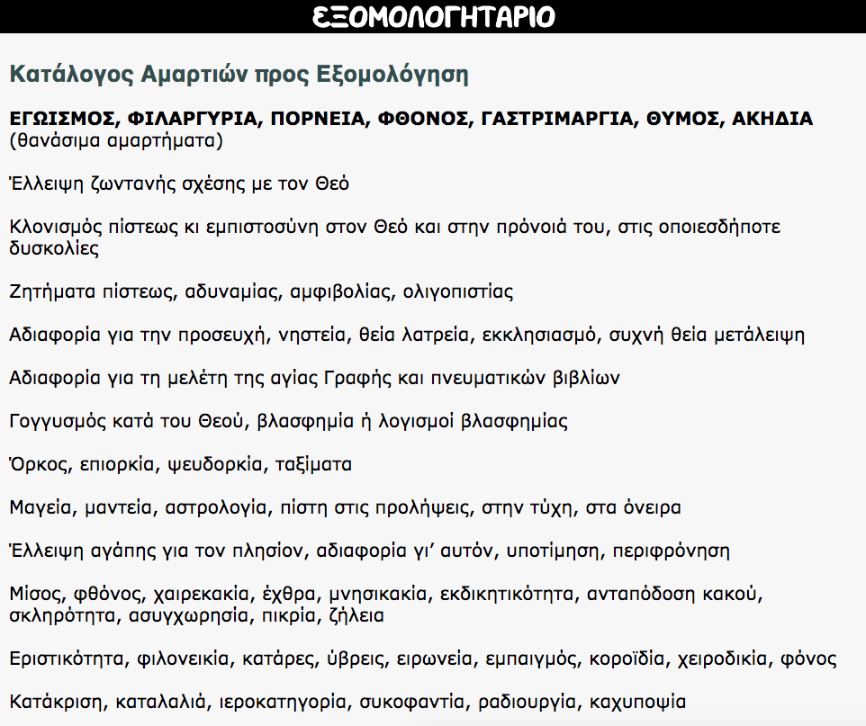

Το εξομολογητάριο αποτελεί ένα χρήσιμο βοηθητικό οδηγό για το μυστήριο της εξομολόγησης. Συγκεκριμένα περιέχει λίστα αμαρτιών όπως:
- Θανάσιμα Αμαρτήματα
- Συγγνωστά Αμαρτήματα
- Αμαρτίες βασισμένες σε παράθεση της Ορθόδοξης Εκκλησίας

Δεν απαιτείται σύνδεση στο Ιντερνετ για χρήση της εφαρμογής

<b>Google Play:</b> https://play.google.com/store/apps/details?id=appinventor.ai_fsiamp.EKSOMOLOGITARIO

